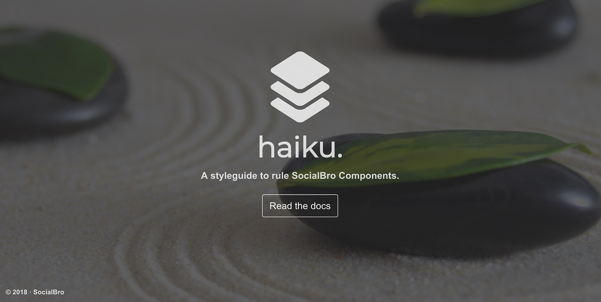

Sandbox tooling made with express, sass, grunt and love.

## Requirements

You'll need to have the following items installed before continuing.

  * [Node.js](http://nodejs.org): Use the installer provided on the NodeJS website.
  * [Grunt](http://gruntjs.com/): Run `[sudo] npm install -g grunt-cli`

## Quickstart

```bash
git clone git@github.com:socialbro/styleguide.git
npm install
```

While you're working on your project, run:

`grunt server`

And you're set!


## Directory Structure

  * `assets/`: Assets files like svgs or png for sprites.
  * `public/`: Public assets, linked from views. Includes stylesheets and javascripts folders.
  * `sass/`: Sass assets.
  * `views/`: Html views flavored as nunjucks files. Include partials folder.
  * `routes/`: Add your routes here.
  * `app.js`: Express file.

## Reference

  * Trello: http://blog.trello.com/refining-the-way-we-structure-our-css-at-trello/
  * Medium: https://medium.com/@fat/mediums-css-is-actually-pretty-fucking-good-b8e2a6c78b06
  * CodePen: http://codepen.io/chriscoyier/blog/codepens-css
  * LonelyPlanet: http://ianfeather.co.uk/css-at-lonely-planet/
  * Github: http://markdotto.com/2014/07/23/githubs-css/
  * The Guardian: https://github.com/guardian/frontend/wiki/CSS-guidelines
